# NER-SAFE — CURRENT OPERATIONAL ARCHITECTURE & DATA FLOW MAP
**Project**: AI-Based Early Warning and Landslide Risk Monitoring System in the North Eastern Region of India  
**Problem Statement**: SIH 2026 — Problem Statement 26001 (MDoNER)  
**Target AOI**: Phase 1 — Meghalaya & Mizoram (`21.0°N – 27.0°N`, `89.0°E – 94.0°E`)  
**Audit Timestamp**: 2026-09-16T12:35:00+05:30  
**Baseline Version**: `nersafe-judge-demo-baseline-1.0` (v1.0.0-judge-demo-freeze)  
**Architecture Rule**: Factual implementation trace only. Clearly distinguishes `LIVE`, `AUTOMATED`, `MANUAL`, `PENDING`, `RESEARCH`, and `BLOCKED`.

---

## 1. End-to-End System Architecture Diagram

```mermaid
flowchart TD
    subgraph S1["1. DATA SOURCES & UPSTREAM AUTHORITIES"]
        D1["NASA GPM Early NRT (3IMERGHHE)<br/>[LIVE - NASA CMR API]"]
        D2["NASA SMAP (SPL3SMP_E.006)<br/>[VALIDATED - HDF5 On-Disk]"]
        D3["ESA Sentinel-2 L2A Multispectral<br/>[LIVE - CDSE Keycloak OAuth2]"]
        D4["ESA Sentinel-1 C-SAR GRD & SLC<br/>[LIVE - CDSE OData / S3]"]
        D5["NASA/USGS SRTM 30m DEM<br/>[VALIDATED - 16 HGT Tiles On-Disk]"]
        D6["IMD Official API Gateway<br/>[BLOCKED - Institutional MoU Required]"]
        D7["IMD Mausam District Nowcasts<br/>[LIVE - Public GeoJSON]"]
        D8["GSI Bhusanket WebAPI v2<br/>[LIVE - Public Bulletin Feed]"]
        D9["GSI NLFC ArcGIS FeatureServer<br/>[BLOCKED - ESRI Token Required]"]
        D10["NDMA SACHET CAP 1.2 Feed<br/>[LIVE - Public Warning Portal]"]
        D11["ISRO Bhuvan OGC WMS Disaster Layers<br/>[LIVE - Public OGC WMS]"]
        D12["Regional OSINT News & SDMAs (8 Sources)<br/>[LIVE - Public RSS / Web]"]
        D13["OSIRIS Platform (USGS & GDACS)<br/>[LIVE - Public REST Feeds]"]
        D14["Mawiongrim Scarp Ground Sensors<br/>[LIVE - 696 Telemetry Records]"]
        D15["Citizen Field Observers<br/>[LIVE - Mobile Web Client]"]
    end

    subgraph S2["2. INTAKE, AUTHENTICATION & QUALITY CONTROL"]
        I1["source_ingestion_manager.py & cdse_client.py<br/>[LIVE - OAuth2 Token Manager & SHA-256 Checksum]"]
        I2["live_assessment_service.py (discover_and_acquire)<br/>[LIVE - Deduplication & Freshness Evaluation]"]
        I3["media_integrity_analyzer.py<br/>[LIVE - AI Synthesis & Duplicate Image Detection]"]
        I4["auth_security.py & database.py<br/>[LIVE - NIST PBKDF2-SHA256 & Session Auth]"]
    end

    subgraph S3["3. PREPROCESSING & SCIENTIFIC FEATURES"]
        F1["Rainfall Anomaly Engine<br/>[LIVE - GPM HDF5 -> 24h Accumulation vs 90th %ile]"]
        F2["Soil Moisture Relative Saturation<br/>[VALIDATED - SMAP / Field Tensiometer Baseline]"]
        F3["Satellite Surface Disturbance<br/>[LIVE - Sentinel-1 Radar Backscatter / S-2 SCL Mask]"]
        F4["Static Geomorphic Vector Extractor<br/>[VALIDATED - Elevation, Slope, Aspect, Curvature, TWI]"]
        F5["InSAR Differential Processor (corrected_insar_engine.py)<br/>[RESEARCH - Pairwise ESD, Goldstein Filter, Unwrapping]"]
    end

    subgraph S4["4. SUSCEPTIBILITY & PREDICTION ENGINES"]
        M1["Primary: Calibrated XGBoost (calibrated_xgboost_model.joblib)<br/>[LIVE - PRODUCTION_OFFICIAL, 10-Feature Contract]"]
        M2["Fallback: Calibrated Random Forest (calibrated_susceptibility_model.joblib)<br/>[LIVE - PRODUCTION_FROZEN_RETAINED, Auto-Fallback]"]
        M3["Parallel Shadow: PyTorch Spatial CNN (cnn_susceptibility_model.pt)<br/>[RESEARCH - 32x32 Patch Gated Shadow Mode]"]
    end

    subgraph S5["5. OPERATIONAL FOUR-FACTOR FUSION"]
        R1["Locked Operational Invariant Formula:<br/><b>Risk_Score = 0.40 * Susc + 0.30 * Rain + 0.20 * Soil + 0.10 * SatChange</b><br/>[LIVE - Invariant across all 48 Hotspots]"]
        R2["Operational Tiers:<br/>CRITICAL >= 0.65 | HIGH >= 0.48 | MODERATE >= 0.32 | WATCH < 0.32<br/>[LIVE - Verified Invariant]"]
    end

    subgraph S6["6. SPATIAL CONSEQUENCE & RUNOUT MODELING"]
        C1["D8 Steepest Descent Hydraulic Routing<br/>[VALIDATED - SRTM 30m DEM, flow_paths.geojson]"]
        C2["Empirical Runout Corridors<br/>[VALIDATED - Alpha-Angle Envelopes, runout_corridors.geojson]"]
        C3["STRtree Infrastructure Exposure Intersection<br/>[VALIDATED - 45k Roads, 296k Buildings, 976 Settlements]"]
    end

    subgraph S7["7. PERSISTENCE & RELATIONAL DATABASE"]
        DB["ner_safe_shared.db (SQLite 3)<br/>[LIVE - 1.1 MB: live_assessments, observation_provenance,<br/>citizen_reports, users, sessions, osint_observations, sensor_telemetry]"]
    end

    subgraph S8["8. REST API & APPLICATION SERVERS"]
        A1["server.py (Base Port 8000)<br/>[LIVE - Mode Separation, Demonstration Engine, CAP Export]"]
        A2["live_sensor_server_extension.py<br/>[LIVE - Sensor Telemetry, Live Heatmap, Multi-Model REST]"]
    end

    subgraph S9["9. OPERATIONAL INTERFACES & DECISION SUPPORT"]
        UI1["ner_safe_live_dashboard.html (Zero-Emoji UX4G 3.0)<br/>[LIVE - Leaflet GIS, 48 Hotspots, Threat Matrix, Provenance]"]
        UI2["ner_safe_live_dashboard_extended.html<br/>[LIVE - Dynamic Heatmap, InSAR, OSINT, IMD Weather Card]"]
        UI3["ner_safe_citizen_app.html<br/>[LIVE - Mobile PWA Web Client, GPS, Offline Outbox]"]
    end

    subgraph S10["10. ALERTING & EXTERNAL DISSEMINATION"]
        AL1["ITU-T CAP v1.2 Feed (cap_alerts.xml & cap_alerts.json)<br/>[LIVE - Validated Open Schema Export]"]
        AL2["Situation Bulletins (SDMA Meghalaya, Mizoram, NH-06/NH-54)<br/>[VALIDATED - Non-Statutory Decision Support]"]
        AL3["Cellular SMS SACHET Gateway<br/>[PENDING - Waiting for Telecom Aggregator Credentials]"]
        AL4["Local Actuator Dispatch (Edge Siren/Buzzer)<br/>[VALIDATED - Zero-Network Blackout Interface]"]
    end

    %% Connections
    D1 & D3 & D4 --> I1
    D2 & D5 --> F2 & F4
    D6 -.->|MoU Gate| I1
    D7 & D8 & D10 & D11 & D12 & D13 --> I2
    D14 --> I1
    D15 --> I3 & I4

    I1 & I2 --> F1 & F2 & F3 & F5
    F4 --> M1 & M2 & M3
    M1 -->|Primary 0.40| R1
    M2 -.->|Auto-Fallback| R1
    M3 -.->|Shadow Eval Only| R1
    F1 -->|Rainfall 0.30| R1
    F2 -->|Soil Moisture 0.20| R1
    F3 -->|Satellite Change 0.10| R1

    R1 --> R2
    R2 --> C1 & C2
    C1 & C2 --> C3

    R1 & R2 & C3 & I2 & I3 & I4 --> DB
    DB --> A1 & A2
    A1 & A2 --> UI1 & UI2 & UI3
    A1 & A2 --> AL1 & AL2 & AL4
    AL1 -.->|Credentials Pending| AL3
```

---

## 2. Stage-by-Stage Implementation Status Matrix

| Pipeline Stage | Implementation Script(s) | Operational State | Execution Mechanism | Safeguards & Invariants |
|:---|:---|:---:|:---:|:---|
| **1. Data Ingestion** | `live_assessment_service.py` `cdse_client.py` `external_data_engine.py` | `LIVE` | Event-driven / Polling loop | Anti-fabrication; honest failure reasons; SHA-256 content verification |
| **2. Quality Control** | `source_ingestion_manager.py` `media_integrity_analyzer.py` | `LIVE` | In-memory validation | Optical SCL cloud masking; AI synthetic image detection; coordinate bounds check |
| **3. Preprocessing** | `process_gpm_rainfall.py` `generate_terrain_derivatives.py` | `VALIDATED` | Deterministic algorithms | Standardized to EPSG:4326; 30m grid harmonization; zero NaN propagation |
| **4. Feature Assembly** | `temporal_feature_engine.py` `promote_xgboost_production.py` | `LIVE` | Python / NumPy array | Exact 10-feature contract: 6 geomorphic terrain + 3 vegetation indices + 1 satellite flag |
| **5. ML Susceptibility** | `susceptibility_provider.py` `promote_xgboost_production.py` | `LIVE` | Scikit-learn / XGBoost | Primary Calibrated XGBoost; automatic RF fallback on error; PyTorch CNN shadow-gated |
| **6. Operational Fusion** | `fusion_engine.py` `live_assessment_service.py` | `LIVE` | Deterministic equation | Invariant weights: $0.40 / 0.30 / 0.20 / 0.10$; zero external weight injection |
| **7. Consequence Analysis**| `step2_trace_flow_paths...py` `step3_intersect_exposure...py`| `VALIDATED` | Shapely STRtree indexing | D8 routing + alpha-angle runout; exposure affects consequence, NEVER risk score |
| **8. Persistence** | `database.py` `observation_provenance.py` | `LIVE` | SQLite 3 (`ner_safe_shared.db`)| Parameterized SQL; NIST PBKDF2 password hashing; immutable audit logs |
| **9. REST API Server** | `server.py` `live_sensor_server_extension.py`| `LIVE` | Python `ThreadingHTTPServer` | Complete mode separation: `OPERATIONAL` vs `DEMO_REPLAY`; zero sensitive leaks |
| **10. Operator Dashboard** | `ner_safe_live_dashboard.html` `...extended.html` | `LIVE` | HTML5 / Vanilla CSS / Leaflet | UX4G 3.0 compliant; 100% SVG icons; EXACTLY ZERO emojis |
| **11. Alert Dissemination**| `alert_dissemination_engine.py` `step1_generate_cap_alerts.py`| `LIVE` | ITU-T CAP v1.2 / Local dispatch| CAP XML/JSON export; multilingual templates; cellular SMS in WAITING_FOR_NETWORK |

---

## 3. Boundary of Active Implementation

### Where Implementation is Active and Verified (`LIVE` / `VALIDATED`)
1. **Core Four-Factor Fusion**: Mathematical calculation across all 48 monitored hotspots in Meghalaya and Mizoram.
2. **Tabular Point Susceptibility**: Calibrated XGBoost model inference with Random Forest fallback.
3. **NASA Satellite Intake**: Live CMR discovery and authenticated HDF5 retrieval for GPM Early NRT.
4. **Copernicus CDSE Intake**: Live Keycloak OAuth2 token generation and Sentinel-1/2 discovery.
5. **Local Consequence GIS**: Pre-indexed flow paths and runout corridors intersecting 45,315 road segments and 296k buildings.
6. **Relational Database**: Fully operational SQLite multi-table schema with RBAC authentication.
7. **REST APIs & Dashboard**: Zero-emoji UX4G 3.0 portal serving live and deterministic demo workflows on port 8000.
8. **CAP 1.2 Export**: Syntactically valid XML and JSON alert feeds.

### Where Implementation Stops / Requires External Authorization (`BLOCKED` / `PENDING`)
1. **Continuous 24/7 Background Service**: Not automated as a Windows OS service daemon; requires active terminal session.
2. **Official IMD Weather Stations**: Blocked at HTTP 401 gate pending departmental inter-agency MoU.
3. **GSI NLFC Live Vectors**: Blocked at ESRI Token Required gate (Code 499).
4. **Public Cellular SMS Broadcast**: Blocked pending telecom aggregator / CDAC SACHET gateway credentials.
5. **Multi-Temporal InSAR Time-Series (SBAS/PSI)**: Pairwise DInSAR is implemented; multi-year persistent scatterer time-series stacking remains a research prototype.
