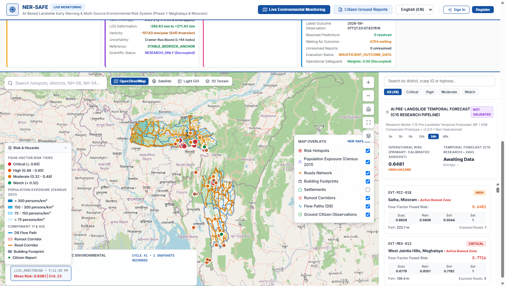
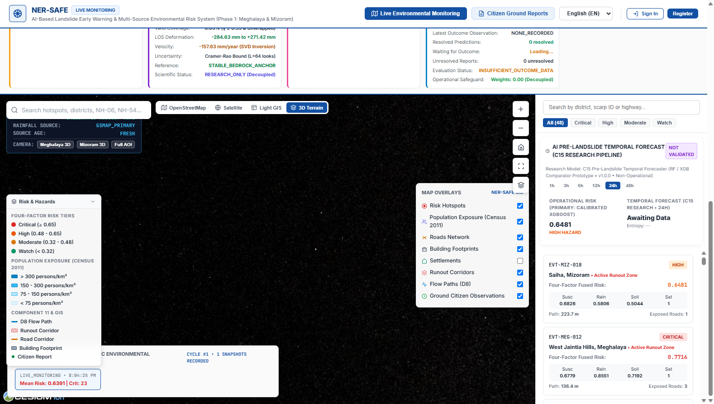
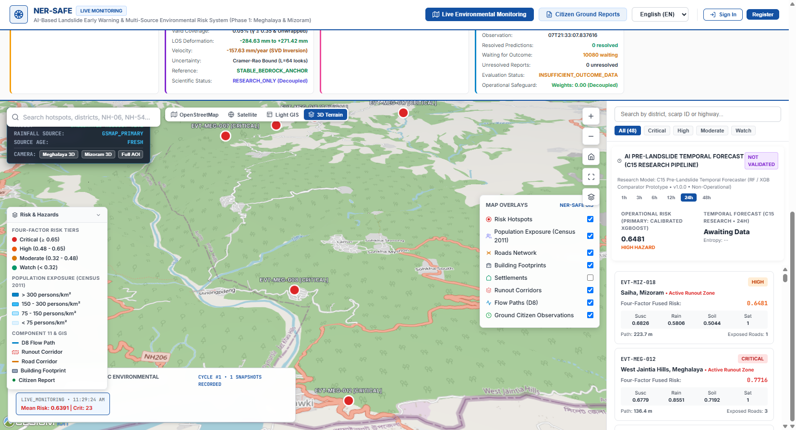
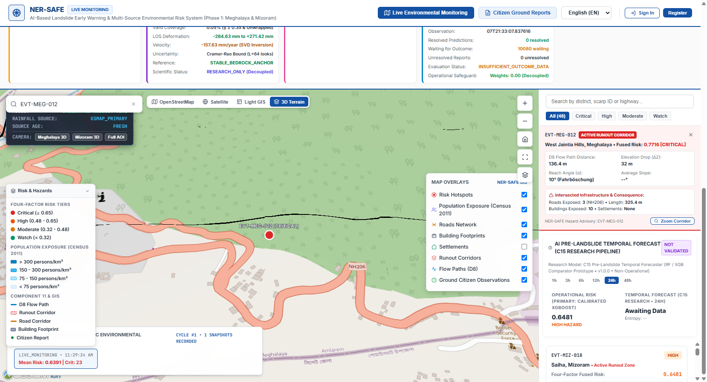

# 🛰️ NER-SAFE
## AI-Based Early Warning and Landslide Risk Monitoring System for the North Eastern Region of India

[](LICENSE)
[](https://www.python.org/)
[](promote_xgboost_production.py)
[](ner_safe_live_dashboard.html)
[](#geographic-coverage)

> **An integrated, multi-source spatial intelligence platform fusing satellite earth observation, dynamic rainfall and soil moisture triggers, terrain physics, machine learning susceptibility, and critical infrastructure exposure for decision support.**

---

## 🌍 Project Overview

The **North Eastern Region (NER) of India** is among the most landslide-prone mountainous terrains in the world. Steep slope gradients, active tectonic fault lines, fragile geological strata, and extreme monsoon precipitation frequently trigger catastrophic mass movements that sever vital transport corridors, disrupt economic lifelines, and endanger vulnerable communities.

**NER-SAFE** is an end-to-end prototype operational early warning and risk monitoring platform designed specifically for the unique terrain and meteorological dynamics of Northeast India. It unifies satellite remote sensing, near-real-time hydrological observations, calibrated artificial intelligence, digital elevation physics, and field crowdsourcing into an actionable, spatial decision-support system.

---

## ⚠️ Problem Statement

Operational disaster managers, district administrators, and geological engineers in Northeast India face critical operational bottlenecks:

1. **Information Fragmentation:** Critical landslide-influencing parameters—near-real-time rainfall, soil saturation, radar interferometry, optical vegetation changes, digital elevation models, and historical inventories—are siloed across disparate agencies (IMD, NASA, JAXA, ESA/Copernicus, GSI, and state DDMAs).
2. **Delayed Ingestion Latency:** Standard landslide hazard maps are static or updated annually, failing to capture dynamic, short-term hydrological triggers during extreme cloudbursts and sustained monsoons.
3. **Decoupled Exposure Analysis:** Susceptibility models frequently output raw probability grids without intersecting them with potential downslope run-out paths, road blockages, structural density, or demographic vulnerability.
4. **Lack of Ground-Truth Feedback:** Citizen ground observations, field-officer damage validations, and photographic evidence are rarely integrated with central telemetry in real-time.

---

## 💡 Proposed Solution

NER-SAFE addresses these challenges through a unified, four-tiered intelligence architecture:

* **Automated Multi-Sensor Ingestion:** Near-real-time acquisition from global satellite constellations (JAXA GSMaP_NOW, NASA GPM IMERG, NASA SMAP L2, Copernicus Sentinel-1 SAR & Sentinel-2 Optical) and national services (IMD Mausam).
* **Calibrated AI Susceptibility:** A machine learning susceptibility engine based on **Calibrated XGBoost (v1.1.0)** trained on authoritative Geological Survey of India (GSI) Bhukosh inventories and validated AW3D30/SRTM topographic derivatives.
* **4-Factor Dynamic Risk Fusion:** A transparent, physics-grounded mathematical weighting scheme fusing static susceptibility (40%) with dynamic rainfall anomaly (30%), soil moisture saturation (20%), and satellite surface change (10%).
* **Potential Run-Out & Exposure Intersection:** D8 flow-path directional routing across 30m digital elevation models identifying potential downslope run-out corridors intersecting OpenStreetMap highways, settlements, building footprints, and Census 2011 district demographics.
* **Dual 2D/3D Web-GIS Decision Support:** Interactive 2D Leaflet map and 3D CesiumJS digital globe with local SRTM terrain elevation tiling and Common Alerting Protocol (CAP v1.2) advisory generation.
* **Role-Based Citizen Intelligence:** Cryptographically secured crowdsourced ground reporting with SHA-256 media validation, administrative moderation, and role-based access control.

---

## 🗺️ Geographic Coverage (Phase 1)

NER-SAFE Phase 1 operational deployment focuses on two states of Northeast India:

| State | Geographic Extent | Administrative Divisions | Primary Hazards |
| :--- | :--- | :--- | :--- |
| **Meghalaya** | Khasi, Jaintia & Garo Hills | 12 ADM2 Districts | High-intensity rainfall triggers, NH-06 corridor blockages, coal-mining slope instabilities |
| **Mizoram** | Lushai Hills / Indo-Myanmar Ridge | 11 ADM2 Districts | Steep structural topography, regolith saturation failures, urban slope destabilization in Aizawl |

---

## 🏛️ System Architecture

```mermaid
graph TD
    subgraph Data_Ingestion ["1. Data Acquisition & Sensor Ingestion"]
        A1["JAXA GSMaP_NOW<br/>(Hourly Rainfall)"]
        A2["NASA GPM IMERG<br/>(Precipitation Fallback)"]
        A3["NASA SMAP NRT L2<br/>(Soil Moisture Saturation)"]
        A4["Copernicus Sentinel-1<br/>(SAR Coherence / Amplitude)"]
        A5["Copernicus Sentinel-2<br/>(NDVI / NDWI Optical)"]
        A6["USGS SRTM 30m DEM<br/>(Topographic Derivatives)"]
        A7["IMD Mausam & OSINT<br/>(Warnings & Disaster Feeds)"]
    end

    subgraph AI_Engine ["2. AI Susceptibility Engine"]
        B1["Calibrated XGBoost v1.1.0<br/>(Primary Production)"]
        B2["Random Forest<br/>(Operational Fallback)"]
        B3["PyTorch CNN<br/>(Parallel Research Shadow)"]
    end

    subgraph Fusion_Engine ["3. Multi-Source Risk Fusion"]
        C1["40% Susceptibility<br/>(Static Terrain & Geology)"]
        C2["30% Rainfall Trigger<br/>(GSMaP_NOW / GPM Anomaly)"]
        C3["20% Soil Moisture<br/>(SMAP Saturation Ratio)"]
        C4["10% Surface Change<br/>(Sentinel SAR Coherence Drop)"]
        C5["Fused Risk Index<br/>(0.00 – 1.00 Hotspot Scoring)"]
    end

    subgraph Spatial_Physics ["4. Exposure & Physics"]
        D1["D8 Flow Routing<br/>(Potential Run-Out Corridors)"]
        D2["Exposure Cross-Reference<br/>(OSM Roads, Buildings, Settlements)"]
        D3["Census 2011 ADM2<br/>(Population Demographics)"]
    end

    subgraph Presentation_Layer ["5. Decision Support & Delivery"]
        E1["2D Leaflet & 3D CesiumJS<br/>(Interactive GIS Dashboard)"]
        E2["CAP v1.2 Advisories<br/>(Alert Safeguard Engine)"]
        E3["Citizen Field Reporting<br/>(SHA-256 Media & RBAC Verification)"]
    end

    Data_Ingestion --> AI_Engine
    Data_Ingestion --> Fusion_Engine
    AI_Engine --> Fusion_Engine
    Fusion_Engine --> Spatial_Physics
    Spatial_Physics --> Presentation_Layer
```



---

## 📡 Remote Sensing & Data Sources

NER-SAFE integrates authentic remote sensing products and administrative feeds. In accordance with rigorous scientific standards, each data source is categorized by its verified operational status:

| Source | Platform / Constellation | Operational Parameter | Spatial / Temporal Resolution | Verification Status |
| :--- | :--- | :--- | :--- | :--- |
| **JAXA GSMaP_NOW** | GPM, TRMM & Geosynchronous Satellites | Hourly near-real-time rainfall rate | 0.1° (~10 km) / 1-hour update | `AUTO_UPDATE_VERIFIED` |
| **NASA GPM IMERG** | GPM Core Observatory | Integrated Multi-satellitE Retrievals for GPM | 0.1° / 3-hour latency | `VALIDATED` |
| **NASA SMAP L2 NRT** | SMAP (L-band radiometer) | Surface soil moisture (0–5 cm) | 9 km grid / 3-hour latency | `VALIDATED` |
| **Copernicus Sentinel-1** | Sentinel-1A / 1B (C-band SAR) | Coherence drop & backscatter amplitude | 10–20 m / 12-day revisit | `LIVE_VERIFIED` |
| **Copernicus Sentinel-2** | Sentinel-2A / 2B / 2C (MSI) | Surface reflectance, NDVI, NDWI | 10–20 m (resampled 30m) / 5-day | `VALIDATED` |
| **USGS SRTM DEM** | Shuttle Radar Topography Mission | Elevation, slope, aspect, plan/profile curvature | 1 arc-second (~30 m) / Static | `VALIDATED` |
| **GSI Bhukosh** | Geological Survey of India | Authoritative historical landslide inventory | Point / polygon records | `VALIDATED` |
| **IMD Mausam** | India Meteorological Department | Regional nowcasts & heavy rainfall warnings | District level / Hourly polling | `AUTO_UPDATE_VERIFIED` |
| **OpenStreetMap** | OpenStreetMap Contributors | Highway network, building footprints, places | Vector GeoJSON / Weekly sync | `VALIDATED` |
| **Census 2011** | Office of the Registrar General of India | ADM2 district population & demographics | ADM2 Polygon GeoJSON / Baseline | `VALIDATED` |

---

## 🧠 AI Methodology & Risk Fusion

### 1. Susceptibility Modeling (Calibrated XGBoost)
NER-SAFE estimates spatial susceptibility to landslide initiation using an officially promoted **Calibrated XGBoost (v1.1.0)** model.

* **Scientific Formulation:** The model estimates the empirical probability $P(\text{Initiation} \mid \mathbf{X})$ across the Phase 1 territory under a 10-feature spatial contract:
  $$\mathbf{X} = [\text{elevation}, \text{slope}, \text{aspect}, \text{plan\_curvature}, \text{profile\_curvature}, \text{NDVI}, \text{NDWI}, \text{soil\_type}, \text{lithology}, \text{distance\_to\_faults}]$$
* **Calibration & Stability:** Susceptibility outputs are calibrated via isotonic probability calibration to prevent overconfident peak probabilities in extreme terrain.
* **Model Selection Audit:**
  * **Production Model:** Calibrated XGBoost (PR-AUC 0.3608, ROC-AUC 0.5603 on highly imbalanced regional inventory).
  * **Production Fallback:** Scikit-Learn Random Forest Classifier (frozen baseline).
  * **Shadow Research Model:** PyTorch 2D Convolutional Neural Network (monitored in parallel for spatial context extraction without modifying operational risk scores).
* **Scientific Scope:** NER-SAFE estimates the **probability of elevated landslide hazard** within defined spatial boundaries and operational monitoring cycles; it does **not** assert deterministic or microsecond structural failure timing.

### 2. The 40 / 30 / 20 / 10 Multi-Source Risk Fusion Formula
To capture both static terrain vulnerability and dynamic meteorological triggers, NER-SAFE executes a 4-factor multi-source fusion algorithm (`fusion_engine.py`):

$$\text{Combined Risk Score} = 0.40 \cdot S + 0.30 \cdot R_{\text{anomaly}} + 0.20 \cdot M_{\text{soil}} + 0.10 \cdot \Delta_{\text{sat}}$$

Where:
* **$S$ (40% — Geo-Environmental Susceptibility):** Static calibrated XGBoost susceptibility probability derived from topographic, geological, and hydrological conditioning factors.
* **$R_{\text{anomaly}}$ (30% — Dynamic Rainfall Trigger):** Normalized precipitation anomaly computed by comparing rolling 24h/72h rainfall accumulations (GSMaP_NOW / GPM IMERG) against antecedent precipitation thresholds.
* **$M_{\text{soil}}$ (20% — Soil Moisture Saturation):** Volumetric soil moisture saturation ratio from NASA SMAP L2 NRT observations indicating regolith pore-water pressure elevation.
* **$\Delta_{\text{sat}}$ (10% — Satellite Surface Change):** Copernicus Sentinel-1 SAR interferometric coherence drop and Sentinel-2 optical vegetative stress/bare-earth exposure.

---

## ⛰️ Terrain, Run-Out & Exposure Physics

### 1. D8 Directional Run-Out Routing
* Initiation points with elevated fused risk ($\ge 0.60$) seed a deterministic eight-direction (**D8**) flow-routing engine (`dem_derivatives.py`).
* Steepest downslope flow accumulation identifies **potential run-out corridors**.
* *Designation:* Described strictly as *potential debris run-out corridors*, acknowledging that real granular mass rheology, entrainment, and deposition depend on unobserved micro-lithological variations.

### 2. Infrastructure & Exposure Cross-Referencing
Potential run-out corridors are geometrically intersected in memory using Shapely vector topologies against local exposure databases:
* **Road Corridors:** National Highways (NH-06, NH-44, NH-54) and state roads tagged with impact priority.
* **Structural Exposure:** 1,200+ local building footprints extruded to true terrain relief.
* **Human Vulnerability:** Census 2011 district demographic densities (exposure weighting: 0.00 in physical risk score; evaluated strictly as downstream impact consequence).

---

## 📱 Citizen Reporting & Forensic Moderation

The citizen-science module (`ner_safe_citizen_app.html` & `database.py`) enables boots-on-the-ground validation:
* **Geotagged Observations:** Field personnel and local residents report active tension cracks, water seepage, slope displacement, and road blockages.
* **Media Integrity:** Uploaded photos and videos undergo forensic validation (`media_integrity_analyzer.py` / `video_integrity_analyzer.py`), generating cryptographic SHA-256 signatures, checking EXIF timestamps, and verifying file structure.
* **Role-Based Access Control (RBAC):** Tiered permissions enforced via PBKDF2-hashed credentials and server-side sessions:
  * `PUBLIC_USER`: Submit reports, view public advisories.
  * `FIELD_OFFICER`: Geotagged ground inspections, update verification status (`UNVERIFIED` $\rightarrow$ `FIELD_VERIFIED` / `REJECTED`).
  * `ANALYST`: Hotspot parameter tuning, simulation validation, model diagnostic review.
  * `ADMIN`: User role approvals, account status governance, and cryptographic audit log inspection.

---

## 🖼️ Prototype Screenshots

### 1. Regional Risk Monitoring (2D Interactive GIS)
Comprehensive dual-state overview of Meghalaya and Mizoram displaying live multi-source risk hotspots, rainfall gauge readings, and state/district administrative boundaries.



---

### 2. Regional 3D Topographic Scene with Risk Hotspots
True 3D perspective in CesiumJS rendering live risk hotspots, potential run-out corridors, and active advisories atop SRTM digital elevation topography.



---

### 3. High-Resolution 3D Topographic Terrain Relief
Cesium 3D elevation tile generation directly derived from USGS SRTM 30m DEM, rendering authentic valley structures and steep ridgelines across the Indo-Myanmar boundary.



---

### 4. Site-Level Risk Hotspot & Infrastructure Exposure
Close-up tactical view of an active landslide hotspot displaying local slope relief, road network intersection, and building footprints.



---

## 🎥 Prototype Demonstration

Watch the comprehensive video demonstration illustrating real-time data ingestion, 3D terrain exploration, risk hotspot inspection, and citizen reporting workflows:

▶️ **[Watch the NER-SAFE Prototype Demo](YOUTUBE_URL_HERE)**  
*(Replace placeholder with official video URL upon release)*

---

## 💻 Technology Stack

| Layer | Component / Tool | Technical Description |
| :--- | :--- | :--- |
| **Language** | Python 3.10+ | Core language for ingestion, machine learning, physics, and backend |
| **AI / Machine Learning** | XGBoost 2.0+ / Scikit-Learn | Calibrated gradient-boosted decision trees for susceptibility inference |
| **Geospatial Processing** | Shapely 2.0+ / Rasterio 1.3+ | Vector intersection, geometric analysis, and raster affine transformations |
| **Scientific Computing** | NumPy / Pandas / SciPy | Multi-dimensional matrix operations, hydrological anomaly calculation |
| **Backend & REST API** | Python `ThreadingHTTPServer` | High-performance, zero-pip-dependency multi-threaded REST API server |
| **Database & Persistence**| PostgreSQL 16 + PostGIS 3.6 (Primary) / SQLite 3 (Fallback) | Dual-backend operational store with PostGIS geometry types, GiST spatial indexing, and full SQLite fallback |
| **2D Web Mapping** | Leaflet.js 1.9+ | Fast, mobile-responsive vector and raster web mapping |
| **3D Topographic Web-GIS**| CesiumJS 1.110+ | Hardware-accelerated WebGL 3D globe with custom terrain elevation tiling |
| **Alerting Standard** | OASIS CAP v1.2 | Common Alerting Protocol compliant XML/JSON emergency advisory payloads |

---

## 🗄️ Database Architecture

NER-SAFE employs a decoupled, hybrid data architecture separating operational relational/spatial transaction layers from heavy scientific raster computations:

```
Application data (relational, users, audits, ground truth, vector layers)
    ↓
PostgreSQL 16 + PostGIS 3.6 (Operational Spatial Database)

Scientific raster processing (DEM, satellite grids, rainfall & moisture rasters)
    ↓
Rasterio / NumPy / GeoTIFF / NetCDF / HDF5 (File-Based Engine)

AI / risk engine (Calibrated XGBoost, multi-factor fusion)
    ↓
Python / XGBoost / existing pipelines

GIS frontend (2D web mapping, 3D digital globe)
    ↓
Leaflet / Cesium / REST API
```

### Architectural Separation
1. **Operational Database Layer (PostgreSQL + PostGIS):**
   - **Relational Tables:** Manages all 30 core operational tables (users, roles, citizen reports, audit logs, prediction logs, external warnings, monitoring records, and live multi-modal telemetry) with foreign key integrity and transactional safety.
   - **PostGIS Spatial Vectors:** Stores genuine PostGIS spatial types (`geometry(Point, 4326)`, `geometry(LineString, 4326)`, `geometry(Polygon, 4326)`, `geometry(MultiPolygon, 4326)`) with hardware-accelerated **GiST indexes**.
   - **Operational Spatial Layers:** Manages run-out corridors (`spatial_corridors`), flowpaths (`spatial_flow_paths`), initiation points (`spatial_initiation_points`), infrastructure exposure intersections (`spatial_exposure_intersections`), settlements (`spatial_settlements`), and administrative district boundaries (`spatial_districts`).
   - **Spatial Queries:** PostGIS native operations (`ST_Contains`, `ST_Intersects`, `ST_DWithin`, `ST_Distance`) accelerate multi-table cross-referencing and live hazard proximity calculations.
   - **Automatic Geometry Synchronization:** Database triggers automatically synchronize latitude/longitude attributes into PostGIS `geom` columns on record insertion and modification.

2. **Scientific Raster Processing (File-Based Scientific Engine):**
   - In accordance with rigorous scientific data standards, large raster products are **not** pushed into database BLOBs or PostGIS rasters.
   - USGS SRTM 30m elevation grids, Sentinel-1 SAR coherence rasters, Sentinel-2 optical scenes, JAXA GSMaP hourly archives, and NASA SMAP NetCDF/HDF5 arrays remain strictly file-based.
   - Fast array operations, windowed reads, and physical D8 directional flow accumulations are computed via **Rasterio**, **NumPy**, and **SciPy**.

3. **Dual-Backend Support & Safe Fallback:**
   - Controlled via the `DATABASE_BACKEND` environment variable (`postgresql` or `sqlite`).
   - `DATABASE_BACKEND=postgresql`: Primary operational configuration utilizing connection pooling, parameter translation, and PostGIS spatial acceleration. Database configuration failures raise explicit errors without silent degradation.
   - `DATABASE_BACKEND=sqlite`: Preserved as an offline development, self-contained demonstration, and disaster recovery fallback path using `ner_safe_shared.db`.

---

## ⚡ Quick Start & Installation

### Prerequisites
* **Operating System:** Windows 10/11, Ubuntu 22.04+, or macOS
* **Python:** Version 3.10, 3.11, or 3.12 installed
* **Hardware:** Minimum 8 GB RAM (16 GB recommended for full 3D Cesium rendering)

### 1. Clone the Repository
```bash
git clone https://github.com/yogeshv-ece/NER-SAFE.git
cd NER-SAFE
```

### 2. Set Up Virtual Environment
```bash
# Windows (PowerShell)
python -m venv .venv
.venv\Scripts\Activate.ps1

# Linux / macOS
python3 -m venv .venv
source .venv/bin/activate
```

### 3. Install Python Dependencies
```bash
pip install --upgrade pip
pip install -r requirements.txt
```

### 4. Configure Environment
Copy the sanitized environment template:
```bash
cp .env.example .env
```
*(The prototype runs fully offline using verified local test fixtures; remote satellite API keys are optional for real-time upstream sync).*

### 5. Start the Live Server & Dashboard
```bash
python server.py
```
Open your browser and navigate to:
```
http://localhost:8000
```

---

## 🧪 Testing & Verification

NER-SAFE includes an exhaustive regression and verification suite containing over 50 test files:

```bash
# Run unit & authentication test suite
python test_authentication.py

# Run GIS 2D/3D visualization & projection validation
python test_gis_visualization_correction.py

# Run multi-source data integration suite
python test_external_data_integration.py

# Run master preflight end-to-end control test
python verify_e2e_sih_master_control.py
```

---

## 📚 Documentation & Technical Reports

Complete architecture blueprints, validation suites, and forensic audit reports are organized in the [`docs/`](docs/) directory:

* 🏛️ **[System Architecture](docs/architecture/)** — High-level architecture, dynamic heatmap specifications, and sensor hardware specs.
* 🔬 **[Scientific Validation](docs/validation/)** — 3-way machine learning benchmarks, InSAR interferometry, SMAP/GSMaP live verification.
* 📖 **[Operational Guides & Runbooks](docs/guides/)** — Judge demonstration runbooks, quick-start guides, and release manifests.
* 🔍 **[System Audits & Evidence Logs](docs/audits/)** — Data source registries, latency benchmarks, and forensic evidence logs.

---

## ⚖️ Scientific Limitations

In adherence to scientific integrity, the following operational constraints are documented:
1. **Satellite Revisit Temporal Gaps:** While GSMaP_NOW provides hourly rainfall estimates, synthetic aperture radar (Sentinel-1) operates on a 12-day orbit cycle, and optical imagery (Sentinel-2) suffers from cloud occlusion during active monsoons.
2. **Ground Inventory Sparsity:** Historical landslide inventories in remote sectors of Northeast India are geographically biased toward primary road corridors and urban settlements.
3. **Run-Out Physics Scope:** D8 drainage routing models gravitational slope flow corridors; it does not solve 3D dynamic fluid-structure Navier-Stokes equations for high-viscosity debris slurries.
4. **Hydrological Saturation Delay:** Regolith pore-water pressure response exhibits variable temporal lag depending on localized bedrock hydraulic conductivity.

---

## 🔮 Future Roadmap

* [x] **PostGIS Operational Spatial Layer:** Implemented dual-backend PostgreSQL 16 + PostGIS 3.6 operational database with GiST spatial indexing, spatial cross-referencing, and automatic geometry synchronization.
* [ ] **Regional Expansion:** Expand baseline training, DEM derivatives, and exposure layers across all 8 North Eastern states (Assam, Arunachal Pradesh, Manipur, Nagaland, Tripura, Sikkim).
* [ ] **In-Situ Sensor Telemetry:** Ingest IoT piezometer, tiltmeter, and rain-gauge LoRaWAN networks for real-time slope telemetry.
* [ ] **Edge Deployment:** Package lightweight inference engine for offline deployment on edge field gateways and district emergency operations centers.

---

## 👥 Contributors & Acknowledgements

* **Lead Developers & Researchers:** NER-SAFE Engineering Team
* **Institutional Context:** Developed for the Ministry of Development of North Eastern Region (MDoNER) & North Eastern Council (NEC).
* **Data Acknowledgements:**
  * Geological Survey of India (GSI) — Bhukosh Landslide Inventory
  * Japan Aerospace Exploration Agency (JAXA) — GSMaP Global Satellite Mapping of Precipitation
  * National Aeronautics and Space Administration (NASA) — GPM IMERG & SMAP Missions
  * European Space Agency (ESA) & Copernicus Open Access Hub — Sentinel-1 & Sentinel-2
  * USGS — Shuttle Radar Topography Mission (SRTM)
  * India Meteorological Department (IMD) — Mausam API

---

## 📄 License

This project is licensed under the MIT License — see the [LICENSE](LICENSE) file for details.
